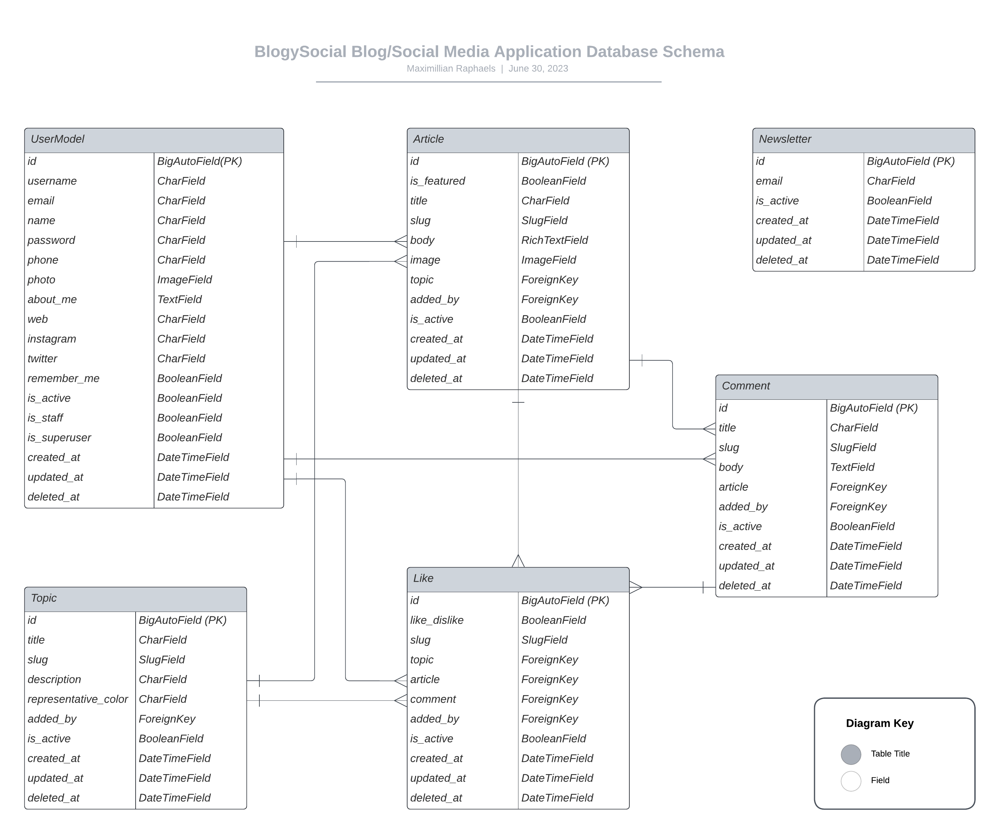

#BlogySocial Blog and Social Media Application

Guides (usage and description) to the BlogySocial application.

**Table of Contents**

1. [What BlogySocial Is](#what-is-blogy-social)
2. [Technologies Utilized in Crafting BlogySocial](#technologies-utilized-in-crafting-blogy-social)
3. [Database Structure](#database-structure)
4. [How to Install and Run the BlogySocial Application Locally On Your Device](#how-to-install-and-run-the-blogy-social-application-locally-on-your-device)
5. [Log into the Application with existing User Credentials](#log-into-the-application-with-existing-user-credentials)
6. [Footnotes !important](#footnotes-important)

## What Is BlogySocial?

BlogySocial is a blog/social media application where people can share knowledge and react to those knowledge shared.

## Technologies Utilized in Crafting BlogySocial

BlogySocial is crafted in the following programming languages and frameworks:

1. **Django (Python)**
   1. **Django Test** (for comprehensive test of the application)
   2. **Coverage** to determine more tests to be ran
   3. **Selenium** for client-side tests
2. vanilla **JavaScript**
3. **Bootstrap 5.3**
4. vanilla **CSS3**

## Database Structure



## How to Install and Run the BlogySocial Application Locally On Your Device

1. You must have Python3 downloaded and installed on your device. Follow the guidelines on the official [Python website](https://www.python.org/downloads/)
2. After installing Python3, download and install a text editor (e.g. [VS Code](https://code.visualstudio.com/Download)) if you do not have one.

---

Then go to your terminal and follow these steps:

3. cd (change directory) into the folder directory from your terminal and create a folder in your favorite directory on your computer manually or you may create one from there using the following commands like below;

```
cd C:\Users\maxim\Desktop>
```

Here I changed directory into my personal Desktop space on my windows Computer. And then;

```
mkdir blogy
```

Or whatever you wish to call the application

4. cd into this newly created folder

```
cd blogy
```

and create a virtual environment

```
py -m venv venv
```

5. Activate the newly created virtual environment so that you can install Django and other dependencies.

```
source venv/Scripts/activate
```

You may decide to skip this step (step 5), to install and run Django from the system-wide installation. But virtual environments are always recommended.

6. Clone this repository from here on Github using either of the 2 commands on your terminal:

```
git clone https://github.com/maxralph1/blogy.git
```

or

```
git clone git@github.com:maxralph1/blogy.git
```

7. Use the command below to install all dependencies I utilized in this application as can be seen from my requirements.txt file

```
pip install -r requirements.txt
```

8. Now, cd into the "blogy" folder included from the cloned github repository and run the command below;

```
cd blogy
```

and

```
py manage.py runserver
```

## Log into the Application with existing User Credentials

Use either of these credentials below to login to existing users in the database we already created.

On the other hand, if you intend to start afresh and know what you are doing, delete the database and run migrations afresh utilizing our existing database schema on this app's codebase.

For generic user:

```
Username: user
Password: 12345678
```

For admin:

```
Username: admin3
Password: 12345678
```

## Footnotes !important

This application is strictly for demonstration purposes. It is not yet production-ready and should never be used as such.

\*\*On the general pattern of coding, if you noticed, the entire application has a specific approach in structure. I however decided to deviate (bring in several flavors) a little (but paid attention not to deviate too much) from these principles so as to showcase my skills.I would stick to a particular pattern in a real-world application.

If you have any contributions/suggestions on how to improve this project, please share.
